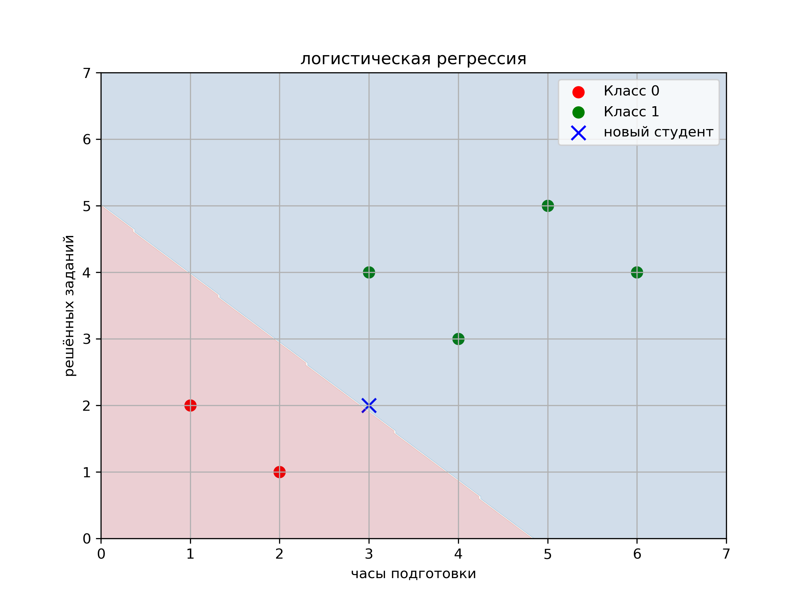

# 🎓 Student Exam Prediction — Logistic Regression ML Project

This project uses **logistic regression** to predict whether a student will pass an exam based on:

- 📚 hours of preparation
- ✍️ number of tasks solved

The project includes visualization of the decision boundary and prediction of a new student.

---

## 📊 Example output



---

## 🚀 How to run

1. Clone the repo or download the files
2. Install dependencies:

```bash
pip install -r requirements.txt

Run the Python script:

python logistic_regression_exam.py

You’ll see the prediction and a visualized decision surface in a saved image (exam_prediction.png).
